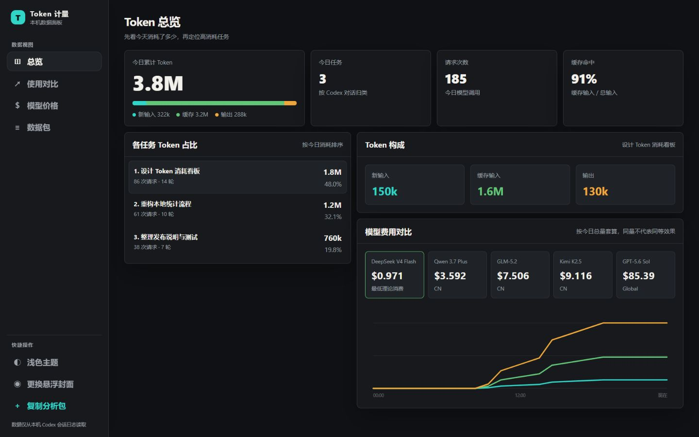
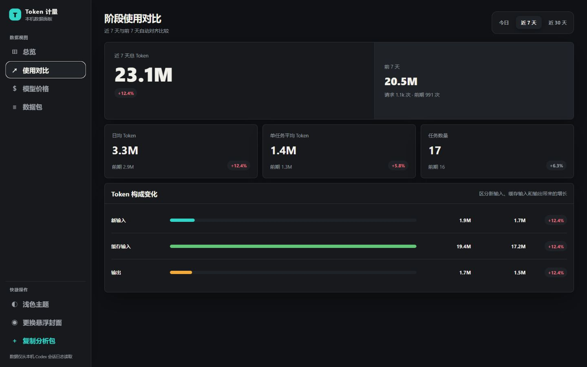

# Token Trace for Codex Desktop

[简体中文](README.md) | [English](README.en.md)

Token Trace is a Windows companion for Codex / ChatGPT Desktop. It shows a draggable floating entry and a local browser dashboard for today's Token usage, per-task share, model-cost comparison, and a copyable AI analysis pack.



> This is the current product UI. The screenshot uses built-in fictional demo data, never a user's session data.

## What it does

- Summarizes today's total Token use, requests, cache-hit rate, and input/cache/output composition.
- Ranks Codex conversations by Token share with compact task titles.
- Compares today with yesterday at the same time, the latest 7 days with the previous 7 days, or the latest 30 days with the previous 30 days. It includes total, daily average, per-task average, task count, and composition changes.
- Compares theoretical cost for the same daily Token composition across editable model price entries.
- Provides a smooth circular floating ball that opens its companion card on hover, docks to either screen edge, and can tuck behind an arrow tab.
- Keeps dashboard navigation, model prices, data pack, theme, and cover controls in one left sidebar.
- Copies a prompt plus sanitized statistics for analysis in any AI assistant.



> The comparison view defaults to the latest 7 days and automatically selects an equally long preceding baseline. All values shown here are built-in fictional demo data.

Run the safe demo dashboard without reading local sessions:

```powershell
node token-stats.mjs --server --demo --port 8767
```

Codex++ is not required. The default mode does not inject scripts into Codex, does not add a sidebar, and does not use debug port `9229`.

## Requirements

- Windows.
- Codex / ChatGPT desktop app.
- Node.js >= 22, or use the one-command installer which downloads an official runtime when needed.

## One-command install

Run this in PowerShell:

```powershell
$v='v1.1.0'; $p=Join-Path $env:TEMP 'Install-TokenTrace.ps1'; try { Invoke-WebRequest "https://cdn.jsdelivr.net/gh/lanm777888999-stack/codex-token-trace@$v/Install-TokenTrace.ps1" -OutFile $p -ErrorAction Stop } catch { Invoke-WebRequest "https://raw.githubusercontent.com/lanm777888999-stack/codex-token-trace/$v/Install-TokenTrace.ps1" -OutFile $p -ErrorAction Stop }; powershell -NoProfile -ExecutionPolicy Bypass -File $p
```

It downloads the fixed `v1.1.0` release from jsDelivr first and GitHub Raw second, file by file. It never calls the GitHub API, needs no GitHub sign-in/token, downloads the official Node.js runtime only when needed, and enables WMI follow mode.

To inspect the installer before execution, open [Install-TokenTrace.ps1](Install-TokenTrace.ps1). To disable automatic following, run:

```powershell
powershell -ExecutionPolicy Bypass -File "$env:LOCALAPPDATA\TokenTrace\uninstall-autostart.ps1"
```

## Portable ZIP

Download [TokenTrace-v1.1.0-portable.zip](https://github.com/lanm777888999-stack/codex-token-trace/releases/download/v1.1.0/TokenTrace-v1.1.0-portable.zip), extract it, and double-click `Install.cmd`. The package includes the Node.js runtime; `Start.cmd` opens the panel manually and `Uninstall.cmd` removes auto-follow mode.

## Run

Manual start:

```powershell
powershell -ExecutionPolicy Bypass -File .\start-token-trace.ps1
```

Server only:

```powershell
node token-stats.mjs --server
```

Dashboard:

```text
http://127.0.0.1:8766
```

## Files

- `token-stats.mjs` - local stats/API/dashboard server.
- `dashboard.html` - browser dashboard.
- `floating-panel.ps1` - independent Windows floating panel, freely draggable, remembers its position, and uses the black-cat Token logo by default.
- `start-token-trace.ps1` - starts the server and floating panel manually.
- `Install-TokenTrace.ps1` - public one-command installer.
- `Build-Portable.ps1` - builds the portable ZIP and SHA-256 file for a release.
- `guardian.ps1` - WMI event guardian that reacts to Codex process start/stop events without polling.
- `install-autostart.ps1` / `uninstall-autostart.ps1` - install/uninstall the scheduled task.

## Dashboard

The browser dashboard focuses on:

- today's total token usage;
- per-task token share;
- today / 7-day / 30-day comparisons against automatically aligned prior periods;
- input / cached input / output composition;
- editable model price comparison;
- one-click prompt + data pack for analysis in another AI.
- dark / light theme switching.

The floating ball uses `assets/token_black_cat.png` by default. Hovering opens the companion card beside the ball; leaving both closes it. Dragging the ball to the left or right edge snaps it into place and exposes an arrow that can tuck or restore it. In the browser dashboard sidebar, use "更换悬浮封面" to upload an image; it is center-cropped into a circular PNG and saved locally at `%LOCALAPPDATA%\ccm-token-spend\floating-cover.png`.

The data pack includes task summaries and numeric metrics. It does not include full conversations, file paths, secrets, or raw logs.

## WMI guardian mode

```powershell
powershell -ExecutionPolicy Bypass -File .\install-autostart.ps1
```

After installation, the guardian waits for filtered Windows WMI process events (no two-second polling). When Codex starts, it launches the local server and floating panel. When a Codex process exits, it confirms all Codex processes are closed before stopping them.

Uninstall:

```powershell
powershell -ExecutionPolicy Bypass -File .\uninstall-autostart.ps1
```

Logs:

- `%LOCALAPPDATA%\ccm-token-spend\guardian.log`
- `%LOCALAPPDATA%\ccm-token-spend\server.log`

Uninstalling preserves local theme, price and custom-cover settings.

## Data Notes

- Only local Codex session logs are read: `%USERPROFILE%\.codex\sessions\...\rollout-*.jsonl`.
- The tool cannot reliably know which old task is selected in Codex if that task has not produced new token requests. The UI therefore uses "recent active task" wording.
- Model prices are editable demo values saved locally.

## Developer Commands

```powershell
node token-stats.mjs                  # most recent thread
node token-stats.mjs --thread <id>    # specific thread
node token-stats.mjs --detail         # include per-request details
node token-stats.mjs --all            # cumulative usage across all threads
node token-stats.mjs --server         # local dashboard/API server
```
